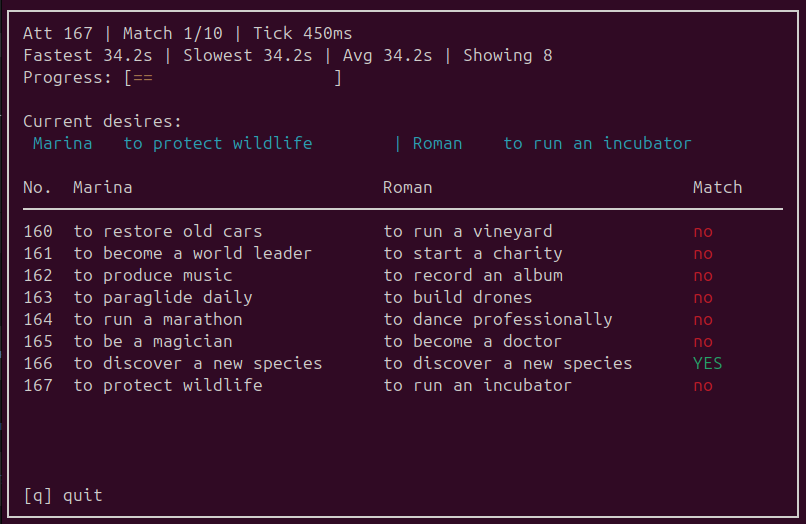

<p align="center">
  
  
  
  
  
</p>

---

# Desire Match Simulator (ncurses, C++20)

Text-mode simulator illustrating multithreading in C++20: two threads (Marina and Roman) randomly generate desires until 10 matches are found.  
The UI is fixed to **80×24** and rendered with **ncurses**.

---

## 🗂️ Project layout

- `src/app`: simulation orchestrator (`DesireSimulator`).
- `src/core`: shared types, desire list, and history tracking.
- `src/ui`: ncurses-based terminal helpers plus HUD/table renderers.

---

## 🧱 Architecture

- **`app/DesireSimulator`** — the main application loop.  
  Creates two threads (Marina and Roman), manages shared state, updates the history of attempts, and calls UI rendering functions.

- **`core/`** — logic and data:
  - `DesireList` – random desire generation;
  - `History` – attempt storage and match counting;
  - `Types` – shared constants and data structures (`Attempt`, screen dimensions, limits, etc.).

- **`ui/`** — ncurses-based text interface layer:
  - `Terminal` – screen clearing, cursor movement, and color handling;
  - `Layout` – text layout and position helpers;
  - `TableRenderer` – rendering of the attempt table with match highlighting;
  - `HudRenderer` – header, current desires, progress bar, and final summary screen.

> The architecture cleanly separates simulation logic from TUI rendering,  
> keeping the project modular, easy to maintain, and extendable.

---

## 🎨 Screenshot



---

## ⚙️ What it does

- Two `std::jthread` workers generate random desires from a 150-item list.
- The main loop tracks attempts, adjusts the tick rate dynamically (faster on no-match, reset on match),  
  shows a colored HUD, a table of recent attempts, and a progress bar.
- The HUD displays **Fastest / Slowest / Avg** time between matches (in seconds, one decimal) for pacing context.
- Upon 10 matches, the program shows a summary with the **most frequent desires**.

---

## 🏗️ Build & Run (Linux)

```bash
cmake -S . -B build
cmake --build build
./build/desire_simulator
```

## 🪟 Windows notes

The project uses **ncurses**.  
On Windows, build with a compatible library (e.g. **PDCurses**) and point CMake to it:
 or use **WSL**, where ncurses is available by default.


**Visual C++** is not supported in the current CMake setup; prefer **MinGW** or **WSL** for a smoother build.

---

## 📦 Key dependencies

- **C++20** compiler
- **CMake ≥ 3.20**
- **ncurses** (or compatible curses implementation)

---

<p align="center">
  <sub>© 2025 vimcomes — Desire Match Simulator is a small open-source demo of multithreading and ncurses-based UI in C++20.</sub>
</p>
